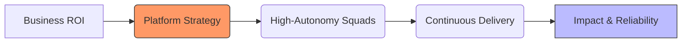

# Vadym Shukurov | Engineering Leader

> **Engineering Execution & Platform Strategy.** I build high-trust, high-autonomy engineering cultures centered on the **"You Build It, You Own It"** philosophy. I specialize in transforming legacy release cycles into high-velocity, Continuous Delivery engines that align technical execution with business ROI.

---

### 🚀 Key Impact Metrics
* **Continuous Delivery:** Transitioned organizations from biannual releases to a predictable ~3-week heartbeat, moving toward daily CI/CD
* **Reliability & Ownership:** Reduced critical incidents by ~20% YoY by shifting operational responsibility and incident response to the squads
* **Quality Excellence:** Scaled unit test coverage from ~6% to 63%+ (85%+ on new code) to enable safe, autonomous deployments
* **Efficiency:** Operationalized AI-assisted engineering practices, reducing defects found in staging/QA by ~50%

### 🧠 Modern Engineering Philosophy
* **You Build It, You Own It:** I empower squads to own the full lifecycle-from architectural design to production monitoring and on-call
* **Small Batch Delivery:** I favor small, low-risk code chunks over "Big Bang" releases to minimize blast radius and increase feedback loops
* **DevEx as a Force Multiplier:** I believe the best engineering standards are those baked into the "Paved Road" of internal tooling

### 🛠 The Executive Toolkit
   
* **Leadership:** Managing Managers, Matrix Leadership, and Engineering Strategy
* **Operations:** DORA Metrics, Release Governance, and Incident Management
* **Architecture:** Monolith Decoupling, API Standardization, and Reliability Engineering
* **Quality Engineering:** Risk-Based Testing, Chaos Engineering, Observability-Driven Development, and AI Governance.

### 📂 Featured Leadership Playbooks
* **[Engineering-Operating-System](https://github.com/vadym-shukurov/engineering-operating-system):** My framework for independent team delivery and continuous deployment gates.
* **[Service-Ownership-Model](https://github.com/vadym-shukurov/engineering-operating-system/blob/main/service-ownership-model.md):** Defining the "You Build It, You Own It" contract between platform and product teams.
* **[AI-Governance-in-SDLC](https://github.com/vadym-shukurov/ai-engineering):** Guardrails for implementing AI-supported PR reviews and coding while maintaining security.
* **[Engineering-Standards-Boilerplate](https://github.com/vadym-shukurov/engineering-standards-boilerplate):** Production-grade code templates in Java and TypeScript demonstrating the "Paved Road" for testability, security, and observability.
* **[Quality-Strategy-Vision](https://github.com/vadym-shukurov/quality-strategy-and-vision):** My executive framework for high-traffic SaaS quality, combining Risk-Based Testing with failure tolerance and AI safety.

## 🧠 The Leadership Operating System
I believe engineering leadership is a product. I open-source my management frameworks to foster transparency and help other leaders scale.

* **[Management & Culture](https://github.com/vadym-shukurov/management-and-culture):** My core framework for 1-on-1s, team-led onboarding, and blameless culture.
* **[Code Stewardship Model](https://github.com/vadym-shukurov/management-and-culture/blob/main/culture/ownership-model.md):** Moving beyond gatekeeping to a "Stewardship" model using CODEOWNERS.

---
### 🤝 Let's Connect
[LinkedIn](https://linkedin.com/in/vadym-shukurov) | [Email](mailto:vadym.shukurov@gmail.com) | **[Read My Manager README ↗️](https://github.com/vadym-shukurov/management-and-culture/blob/main/MY_USER_MANUAL.md)**
